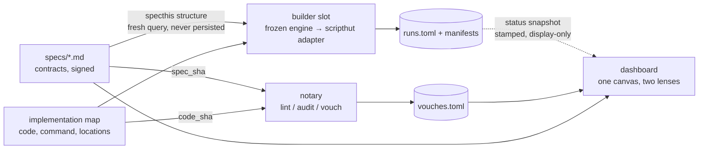

# specthis — design from cakm evidence

**Status: settled direction, 2026-07-20.** Distilled from ~3 weeks of intensive
specthis usage in the cakm repository (v0.0.26 from PyPI; this repo is at
v0.0.27) plus the design session of 2026-07-20. This document replaces the
earlier six-improvement draft in full; §13 maps each original finding to where
it landed.

Two tests adjudicated every decision below, and they are the real invariants —
the design is just their closure:

1. **What should drift when X changes?** A judgment should expire exactly when
   its subject changes — never for layout, never for someone else's edit.
2. **One question per artifact.** Every file a human maintains answers exactly
   one question; fusing answers is where the tool stopped being holdable.

---

## 1. Evidence base

All numbers re-derived 2026-07-20; each row lists its re-derivation command.
Counts are pinned to this date and will drift.

| Claim | Verified value | How to re-derive |
|---|---|---|
| Vouch rows / run rows | **119 / 106** | `tomllib` count over `specs/vouches.toml`, `specs/runs.toml` |
| Declared smoke/full entry pairs | **55** (119 entries under `## Entries` in `specs/*.md`) | regex `### <name>` under `## Entries` |
| Pairs with both sides vouched | **51**; **51/51 identical `spec_sha`** (100%); **46/51 identical `code_sha`** (90%) | join vouches on `_smoke`/`_full` stem |
| Committed `dag.json` staleness | last commit Jul 16; embedded per-node status claimed **72 "audit needed"** vs ≈3 actual | `git log -- dag.json`; count `entries[].status` |
| Ledger-corruption incident | `journal/2026-07-08-frontier-clear-specthis-migration.md` §"Fire-and-forget dispatch corrupted the ledger" — `run --stale` recorded Jul-2 bytes as Jul-8 products; double-submitted one workflow 19 s apart | read the journal entry |
| Adopt protocol (the fix, by discipline only) | `journal/2026-07-02-remote-compute-ledger-loop.md`: manifest sidecar → `run --adopt` verifies signature, fails closed | read the journal entry |
| `consumes:` is file-level | `parse.py:114` — every entry inherits the file frontmatter union | 0.0.26 sdist |
| Signature already excludes spec text and vouches | `check.py expected_inputs()` — scripts + workflows + package + upstream `output_sha`s only | 0.0.26 sdist |
| Re-stale churn (overproduce) | Jul-8 journal: report export rewrites all fragments, so recording one re-stales the rest | read the journal entry |
| Code weight (this repo, v0.0.27) | kernel (parse+hashing+ledger+check) **991** lines; presentation (export+dag+serve+preview+icons+timefmt+templates) **~3,733** | `wc -l src/specthis/*.py src/specthis/templates/*` |
| Scripthut convergence | `TaskDefinition` (`scripthut/src/scripthut/runs/models.py:75`) has `dependencies`, content-hashed `inputs`, cached+restored `outputs`; dep order enforced by run manager (`models.py:589`); cache key = command + env + **git commit** + input hashes (`runs/cache.py`) | read the scripthut source |
| Figures-as-functions failed | early cakm attempt; each figure needed code tailored to its result; `figure-kind` deleted with routing 2026-07-06 | repo history |

**Diagnosis in one paragraph.** Every clear win was a kernel invariant, mostly
subtractive (prose and vouches excluded from signatures; two small honest TOML
ledgers; itemized break reasons; a fail-closed adopt protocol). Every pain was
fusion or ceremony: two state machines interleaved in one command surface and
one status enum (which is how `dag.json` lied); attestation scaled with
instances instead of code (the 51/51 finding); output walls; bookkeeping
commits. The presentation layer grew to ~4× the kernel and produced the only
trust incident. The data model never coupled the two state machines — the
fusion was entirely in the product surface.

---

## 2. The decision: specthis is the notary

The core loop is **audit → vouch**, not check → run. Specthis is the
**pipeline spec language + its notary + its viewer**:

- It is domain-committed — specs describe pipelines (dataflow interfaces,
  judgeable structure), not generic attestation blocks.
- It knows the pipeline as **structure** (design — entries, interfaces,
  edges), never as **state** (process — signatures, staleness, caching,
  scheduling, remote execution).
- The current builder (`check`, `run`, `cache`, `remote`, adopt machinery) is
  **extracted under its own name and frozen** at current behavior,
  maintenance-only. cakm continues to work unchanged. The builder slot is
  later contested by a scripthut adapter (§7).
- **No gate in either direction, ever.** The builder never reads vouches;
  vouches never enter run signatures. Trust ("is this figure both fresh and
  vouched?") is a read-time join, not a lock.

**Deletability tests** (the operational form of the boundary — both must hold
at all times):

> Delete `runs.toml` → specthis is fully functional; the freshness lens simply
> has nothing to draw.
> Delete `vouches.toml` → the builder is fully functional; no judgment was
> ever load-bearing for a build.

---

## 3. Interface: three roles, four artifacts

| Role | Artifact | Signed? | Answers |
|---|---|---|---|
| **Author** | `specs/*.md` | yes — hashed and vouched | *What must be true?* |
| **Implementer** | implementation map (one TOML) | no — self-policing via hashes | *Where and how is it done?* |
| **Notary** | `vouches.toml` | is the record | *What have I judged?* |
| **Builder** | `runs.toml` + run manifests | is the record | *What has been produced?* |



The **structure query** is the export contract: `specthis structure` prints
JSON to stdout, derived fresh from the specs at every call — a query, never an
artifact (a persisted structure file is the dag.json disease; if a file form
is ever needed it carries a `spec_state` hash and consumers verify it against
current specs, failing closed — the adopt discipline reapplied). Schema
`specthis-structure/1`, additive evolution: per entry, logical
consumes/produces, resolved `upstream` edges (edge resolution is graph
semantics and specthis owns it — one resolver, not N), code manifests,
`spec_state`. No prose, no vouch state, no status, no invocation.

The **status snapshot** flows back: per entry, `fresh | stale | missing |
unknown`, optional `output_sha`, last-run, duration, reason — rendered as a
claim ("as reported by `<builder>` at `<time>`"), never as truth specthis
certifies. Tiered: tier 0 = outputs exist (any runner can report it); tier 1
= content-signature staleness; tier 2 = timings, adoption state. The dashboard
renders whatever tier is present, labeled.

The entry namespace plus `spec_state` is the **entire shared vocabulary**
between the two sides.

---

## 4. The spec format: pure contract

A spec file is ordinary markdown. The grammar is five rules, three field
names, four inferable types — specs contain **prose and logical interface,
nothing else**. Every removal made in reaching this format deleted layout;
what remains is only things a human asserts. (Fixed-point test: removing
anything further deletes meaning, not location.)

1. **Frontmatter** carries display metadata only (`group:`, `priority:`).
   Nothing semantic — file-level `consumes` is gone.
2. **A heading whose section contains a `- key: value` field list declares an
   entry.** The heading text is the entry name — slug-like, unique repo-wide
   (lint-enforced); it is the key that `vouches.toml`, `runs.toml`, the
   implementation map, and builder tasks all share.
3. **An entry's block runs from its heading to the next heading.** Everything
   inside is hashed into `spec_sha` — editing an entry's prose drifts *its*
   vouch and nobody else's. Prose outside any entry is unsigned narrative;
   when a sentence out there starts mattering, that is the signal it should
   become an entry.
4. **Recognized fields:** `consumes`, `produces` (logical product names; a
   physical path is legal only in a source entry's `produces`), bare `code`
   (library marker), `props` (reserved for the deferred template tier).
   Unknown keys are lint **errors** — never silently ignored (this is what
   protects against a typo demoting an entry to narrative).
5. **Type is inferred from fields; lint enforces the legal combinations** and
   names the missing ingredient on failure.

| Type | Ingredients | Vouch attests | Computable? |
|---|---|---|---|
| **Source** | prose + `produces:` physical path | "this data is what it claims" (provenance) | no — leaf, content is hashed |
| **Library** | prose + bare `code` | "these functions meet their contract" | no |
| **Computable** | prose + logical `consumes` + `produces` | "this transformation is implemented correctly" | **yes** |
| **Template** *(deferred)* | prose + `props` + interface | "…for *any* conforming input" | no — instances are |

The vouch statements strengthen down the table; templates sit last because
theirs is the strongest claim a human can be asked to sign (§8).

**Worked example** — one file mixing types, reading as a chapter:

```markdown
---
group: data
---

# Wage data

Matched employer-employee panel, 2005–2019. Opening prose is narrative:
context for the reader, signed by no one.

### raw-wages

IPUMS extract #14, men 25–55. Education recoded upstream — see the
codebook oddity on `educ99`. Never re-download without bumping the
extract number here.

- produces: data/raw/wages.parquet

### wage-helpers

`winsor(x, p)` truncates symmetrically at percentile p, preserving NaN.
`harmonize_educ` maps all three coding regimes to one 5-level scheme.

- code

### clean-wages

Drop negative wages, winsorize at the 99th percentile via `winsor`,
harmonize education. One row per worker-year; no duplicates.

- consumes: raw-wages
- produces: wages-panel

### wage-moments

Variance decomposition moments for calibration, on the clean panel.

- consumes: wages-panel
- produces: wage-moments
```

**Wiring is logical-name matching** — consumers name what producers name; one
rule, one namespace that carries meaning instead of layout. Source entries are
the boundary where physical binds to logical on the input side; run manifests
bind logical to physical on the output side (§5).

---

## 5. The implementation map, and mechanics

Everything the implementer decides lives in **one implementation map**
(currently `bindings.toml`; deserves a better name — open seam, §9):

```toml
[clean-wages]
code    = ["scripts/clean_wages.py", "scripts/lib/winsor.py"]
command = "python scripts/clean_wages.py --raw {raw-wages} --out {wages-panel}"
out     = { wages-panel = "out/panels/wages.parquet" }
# resources: partition, cpus, gres, ... (builder passes them through)
```

It is unsigned but **self-policing**: the notary reads `code` and hashes the
listed files' *content* into `code_sha` — so adding, removing, or editing a
mapped file drifts the vouch; the implementer cannot change what is judged
without the notary noticing. Declared output locations are *verified* by the
run manifest at adopt time (v1 takes the practical form: declared statically,
verified dynamically — §9). Commands reference products by `{logical-name}`;
the builder injects concrete paths, so downstream code never hardcodes
upstream layout.

**Content-addressing everywhere, and the change accounting it buys:**

| Change | Consequence |
|---|---|
| Edit an entry's prose/contract | that entry's vouch drifts; consumers untouched |
| Rename a logical product | real respecification — consumer specs edit, vouches drift (correct: the interface changed) |
| Edit a mapped code file's content | `code_sha` drifts (re-judge) + staleness (re-run) |
| Move/rename a code file, same bytes | **nothing drifts anywhere** (`code_sha` is a content set, path-free) |
| Move a physical output, same bytes | **nothing** — manifest points anew; content hash unchanged; downstream not even stale |
| Edit a consumed config file | staleness fires (it's a hashed input); drift too if enrolled in an entry |

**Lint owns structure**, and fails loud: name coverage (every code file under
the scripts tree claimed by some entry — judgment coverage is a checkable repo
property), dangling consumes, orphan products, duplicate producers, cycles,
unknown fields, illegal type combinations.

**The dashboard: one canvas, two lenses.** The canvas is structure — specthis's
own material (spec documents + DAG). Judgment (vouch drift, from
`vouches.toml`) and freshness (from the status snapshot) are two *toggleable
overlays*, each with one remedy vocabulary — judge or recompute. They are
**never merged into one status word**: the fused enum is exactly what the
committed `dag.json` serialized when it claimed 72 entries needed audit
against ≈3 actual. Status is never serialized into committable artifacts;
any static export carries an "as of commit X" stamp.

**Notary ceremony rules** carried from the evidence: attestation attaches to
(spec block, code) and never multiplies with instances — the smoke/full pairs
(51/51 identical `spec_sha`) were two evaluations of one judgment, and under
this design the profile is a run axis, not a second vouch. Vouches never
cascade (attestation is list-shaped); runs cascade via content hashes
(execution is graph-shaped). Command outputs fit on one screen: audit lists
only judgments owed and never mentions staleness; the builder's frontier view
never mentions vouches; anything long goes behind `-v` or `--json`.

---

## 6. Ledgers and the run protocol

`vouches.toml`: one row per judgment — entry, `spec_sha`, `code_sha`,
verdict, attester, date. `runs.toml`: one row per instance run — signature
(content hashes of code + resolved inputs), product hashes and locations (from
the verified manifest), timing.

**Adopt is the only write path.** The run manifest declares logical product →
physical location + content hash; adoption verifies against expectations and
only then writes the ledger row. This is the Jul-2 protocol made structural
instead of disciplinary — the Jul-8 corruption (`run --stale` certifying
Jul-2 bytes as Jul-8 products) is not a forbidden action but an impossible
one. Overproduce detection falls out as a side effect: the manifest is a
declaration of what was written, so "wrote undeclared products" (the
report-fragment re-stale churn) and "declared but didn't write" are one
comparison at adopt time.

---

## 7. The runner: a light executor layered on scripthut

**Settled by use, 2026-07-20:** the runner architecture is the current one —
specthis's light executor on top of scripthut — kept as-is, extracted, and
frozen. It looks redundant (two caches, two hash schemes) and is in fact a
principled two-layer memoization with long precedent (make above ccache,
Bazel's action cache above a remote CAS):

- **Pipeline layer** (the light executor — *the record*): signatures over
  code + upstream `output_sha`s, the frontier, `runs.toml`. Dedupes across
  commits and time. Source of truth.
- **Task layer** (scripthut's result cache — *the shortcut*): key = command +
  env + git commit + input hashes, restore-on-hit. The commit in the key
  means it dedupes only *within* a commit — retries and submission storms
  (it would have absorbed the Jul-8 19-second double submission). Disposable.

The redundancy is benign, checkably: scripthut's key is strictly finer, so
layer disagreement only ever wastes compute, never yields wrong bytes — and
adopt verification screens content hashes before the ledger accepts anything
regardless. **Disposability test** (sibling to the deletability tests): wipe
scripthut's cache → only compute is lost; wipe `runs.toml` → provenance is
lost. Two caches, one load-bearing.

Consequently the two scripthut feature requests contemplated during design
(inputs-only cache key; dry-run probe) are **unnecessary** — they only serve
a consolidation where scripthut becomes the whole builder. Consolidation
remains possible and the schema convergence is real (verified 2026-07-20,
kept below for the record), but it is optional future work, worth doing only
if the two-layer bookkeeping starts hurting in practice:

| Builder slot needs | Scripthut has | Verdict |
|---|---|---|
| Accept a task list | `POST /tasks/run`; source workflows; `generates_source` (a task that emits task JSON — the adapter is scripthut's *native* extension pattern) | yes |
| Dependency-order execution | run manager enforces `dependencies`, `DEP_FAILED` propagation — backend-agnostic | yes |
| Per-task status | `GET /runs/{id}` with per-item status + logs | yes |
| Freshness probe without running | key machinery exists (`runs/cache.py`); no dry-run endpoint | **small feature** |
| Per-entry code granularity | cache key includes git commit → every commit invalidates everything | **small feature**: opt-in inputs-only key mode; adapter puts code files into `inputs` |

If consolidation is ever wanted, the adapter is a task-generator script
(~200 lines): `specthis structure` + the implementation map → topo-sorted
task JSON; run state + cache probes → the status snapshot; adopt writes
`runs.toml`. Scripthut's shape forces submit-then-adopt. Until then, the
light executor is frozen exactly as it stands — "works quite well right now"
*is* the freeze rationale: keep it working, stop growing it.

Off-the-shelf local runners were assessed (2026-07-20) and declined as
defaults: **DVC** satisfies the semantics (content-addressed deps + cmd in
`dvc.lock`, `dvc status` probe, run-cache restore) and remains a viable
community adapter target, but brings workspace-linking opinions and a large
concept surface. **dud** is philosophically kin (UNIX-y, rclone-delegating)
but deliberately rejects the contract — no rebuild on command change, manual
`dud commit` — and has been quiet since mid-2024; its rclone pattern is worth
borrowing for cache transport, not the tool. A clean-room ~300-line
**reference runner** against the structure contract remains the right
long-term ship for the public repo (it doubles as proof the contract is
complete), but is not urgent while the light executor serves.

---

## 8. Deferred: the template tier

**Designed, forward-compatible, zero lines until triggered.** The trigger:
when the second real dataset arrives, write its spec family by hand *as if*
templated; where that exercise creaks is the design input. The base format
needs no changes to receive the tier — a singleton is the degenerate case (a
template with zero props), so nothing written today is ever rewritten;
promotion is a two-line local edit.

Mechanics as designed:

- `props` declares free variables; placeholders appear in the logical
  interface. Instances are named `clean-wages[dataset=chile]` — the ledger
  and task key.
- **Instantiation is demand-driven — there is no registry.** Concrete entries
  (tables, figures, the paper) are the roots; demanding a product that only a
  template's parameterized `produces` can match binds the props by
  unification and instantiates, recursively up the chain (make's `%` pattern
  rules, forty years of precedent). Every registry considered along the way
  (`[axes]`, a deliverables file, an axis entry type) was compensation for a
  missing parameter-passing mechanism, and each dissolved once calls could
  pass values. The value choice is signed *where it is used* — the caller's
  prose says "we compare Chile and Argentina," which is where a referee asks.
- **Identity in the name, payload in a file.** A prop is a short scalar that
  distinguishes instances that must *coexist*; rich or structured values go
  in a named config file that is a hashed input (change semantics differ:
  path/name prop → new instance alongside the old; file value → same
  instance goes stale). When values get numerous, pass one prop naming a
  bundle.
- **Invariants:** every prop appears in every `produces` name (instances
  cannot collide, and unification can always bind fully); `code` mapping
  stays concrete — one manifest, one vouch covering the template; template
  produces-patterns must not unify with each other (duplicate-producer lint,
  generalized).
- **Promotion is earned, demotion is cheap.** Rule of three with data-only
  diffs before promoting; the moment one instance needs different code, it is
  demoted to a singleton in one operation. The escape hatch is load-bearing:
  cakm's figures-as-functions attempt failed precisely because tailoring
  *was* the work, and the wrong abstraction accretes per-instance branches
  under one signature. The editorial end of the pipeline (figures, tables)
  stays hand-made, likely forever.
- **The standing caution** that defers this tier: a template vouch is a
  universally quantified claim, strictly stronger than "it worked on Chile,"
  and research correctness is data-dependent in practice. Demand-driven
  elegance does not make that sentence easier to honestly sign.

---

## 9. Open seams

- **Product-location surfacing:** v1 takes the practical form — locations
  declared in the implementation map, *verified* by the run manifest at adopt
  — so task generation stays single-pass. The pure form (revealed only at run
  time, builder learns paths from upstream manifests) remains available if
  declared locations prove annoying.
- **The implementation map needs a name** that isn't `bindings.toml` — it is
  the implementer's file, read by both machines.
- **Migration is real this time:** moving existing specs from paths to
  logical names touches every entry once. Mechanical and scriptable, but not
  free; do it when the port is ready to receive cakm, not before.
- **Audit UX details** (showing the code diff since last vouch; batch
  vouching ergonomics) are undesigned — deliberately, until the audit loop is
  lived in.

## 10. Tooling owed by the design

These stopped being niceties the moment paths left the specs — they are the
other half of that trade: **`specthis where <name>`** (logical name → current
location, content hash, produced-by, consumed-by), the **why-chain** ("this
instance exists because table-southern-cone demands it"; lint errors walk the
demand chain back to the call site), the **audit view**, and quiet defaults
everywhere (counts + actionable items; walls behind `-v`; `--json` for
user-built views).

## 11. Standing prohibitions

No gate in either direction. No glob/wildcard instance discovery — the
instance set is a function of committed files, never of the filesystem. No
fused status enum, anywhere, ever. No serialized status in committable
artifacts. No new reference forms in the spec grammar beyond name matching
(a door held as a door). No presentation-layer growth until the daily loop is
light. No figure-kind resurrection; the editorial end stays hand-made.

## 12. Sequencing

Each stage pays for itself; stop after any of them better off.

1. **Subtract and separate** (no data-model changes): quiet outputs; split
   audit view from frontier view; status out of committable artifacts;
   presentation freeze.
2. **Extract and freeze the builder**; define the structure/status contract
   descriptively from what the frozen builder already consumes and emits.
3. **The pure-contract format** in this repo: logical names, implementation
   map, content-addressed `code_sha`, coverage lint, `where`/why-chain.
4. **(Optional) scripthut consolidation** — only if the two-layer
   bookkeeping starts hurting; would need scripthut's inputs-only key mode
   and a dry-run probe. **(Optional) reference runner** for the public repo
   when the contract is published.
5. **Template tier** — only on the second-dataset trigger.

## 13. Traceability: original findings → where they landed

| Original finding (six-improvement draft) | Where it landed |
|---|---|
| 1. Notary/builder split, cert as gate | The split *is* the product decision (§2); the **gate is killed** — read-time join only |
| 2. Vouch per stem; profile as run axis | Notary ceremony rule (§5); generalizes to templates (§8) |
| 3. Derived views must not lie | Made structural: status is never specthis's to persist (§3, §5) |
| 4. `check` should triage | Quiet defaults + the loop split (§5, §12); per-builder frontier is the builder's concern |
| 5. Enforce the adopt protocol | Adopt is the only write path (§6); scripthut's shape forces it (§7) |
| 6. Entry-level `consumes` | Subsumed: interfaces are per-entry by construction in the new format (§4) |
| minor: overproduce detection | Free side effect of manifest verification (§6) |
| minor: batching ledger commits | Unaddressed; revisit once the new loop's commit rhythm is observed |
